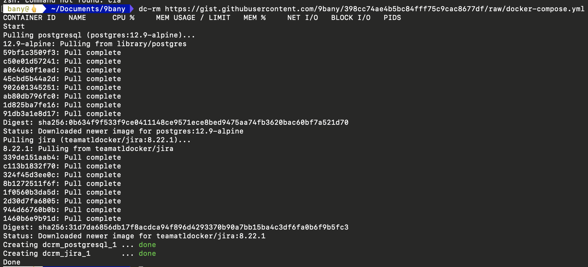

# docker-compose-rm
docker-compose running with remote gist file.

## Manual install 

Download `dc-rm` file to your machine.

```bash
# provide permission
chmod +x  dc-rm 
# move to bin
mv dc-rm /usr/local/bin 
```
## Usage

```bash
# url is your docker-compose file on gist
# Example: https://gist.githubusercontent.com/9bany/398cc74ae4b5bc84fff75c9cac8677df/raw/docker-compose.yml
dc-rm <url>
```

<br>
<br>


